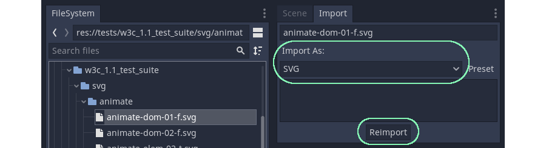
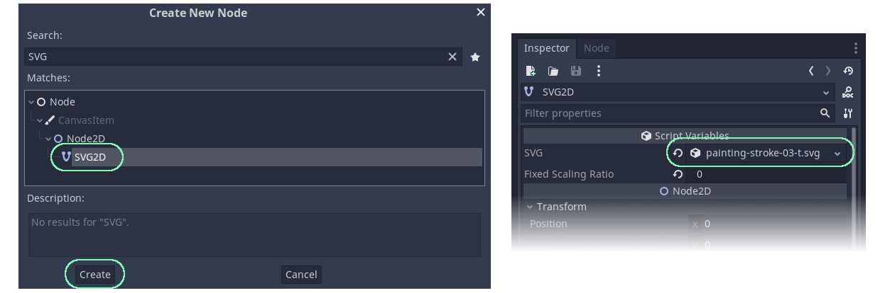

# Godot SVG

This Godot 3.5 plugin **renders SVG files at runtime**. It achieves the effect of infinite scaling and smooth curves by calculating the curves in shaders drawn on polygons.

To be clear, Godot already has built-in functionality to import SVGs and display them as rasterized (pixel map) textures in-game. This is likely what you should do 90% of the time instead of using this plugin to render every SVG in your game.

It is **HIGHLY RECOMMENDED** to use this plugin with the GLES3 renderer, as GLES2 does not support many of the functions used to render SVG on the GPU (dFdx/dFdy/fwidth is used for anti-aliasing).

## Alpha Testing Caveats

This software is in early development.

1. **If your SVG has self-intersecting paths, you may see visual bugs. There is a lot of code written to solve this scenario, but it is still being worked on and there are many W3C test suite examples where it is known to not work.**

2. **You may run into a problem where loading certain SVG files causes Godot to freeze, due to the path solver getting stuck in an infinite loop. To prevent this, don't use SVGs with self-intersecting paths or thin strokes.**

3. **Check the support table at the bottom before reporting bugs.**

## Godot Core Issues

Resolving the following issues in Godot core will improve this plugin. Please visit them and give a thumbs up.

1. [OpenGL: MSAA antialiasing is not reimplemented yet](https://github.com/godotengine/godot/issues/69462) - SVGs are drawn on meshes, there are noticable aliasing artifacts especially as you scale out. This will fix that.

2. [Expose _edit_get_rect, _edit_use_rect to gdscript](https://github.com/godotengine/godot-proposals/issues/5289) - SVG2D is set up as a custom node, without this engine feature you cannot resize and rescale it with editor controls (must use the inspector).

## Installation

Copy the `addons/godot-svg` folder in this repository into your Godot project. Make sure the folder sits exactly at the path `res://addons/godot-svg`. If you put it somewhere else, some things like icons may break.

In Godot, go to `Project -> Project Settings -> Plugins` and check the `Enable` checkbox.

## Usage

1. When importing a SVG into Godot, it defaults to "Import As: Texture". Change this dropdown to "Import As: SVG", then re-import.

    

 

2. Now in a 2D scene, add a SVG2D node. Drag & drop your SVG file to the "SVG" property of this node, and you will see the SVG rendered in realtime!

    

### The SVG2D Node

Use in 2D scenes similar to how you would use a *Sprite*. The default size of the SVG2D is determined by the [`viewBox`](https://developer.mozilla.org/en-US/docs/Web/SVG/Attribute/viewBox), [`width`](https://developer.mozilla.org/en-US/docs/Web/SVG/Attribute/width), and [`height`](https://developer.mozilla.org/en-US/docs/Web/SVG/Attribute/height) attributes on the imported [`<svg>`](https://developer.mozilla.org/en-US/docs/Web/SVG/Element/svg) element.

### The SVGRect Node

Use in 2D scenes similar to how you would use a *TextureRect*. How the SVG fits inside of this rectangle is determined by the [`preserveAspectRatio`](https://developer.mozilla.org/en-US/docs/Web/SVG/Attribute/preserveAspectRatio) attribute on the imported [`<svg>`](https://developer.mozilla.org/en-US/docs/Web/SVG/Element/svg) element.

### SVG2D & SVGRect Documentation

These nodes share a similar API.

**PROPERTIES**

| Property Name | Value Type | Notes |
|:-----|:--------------|:------|
| svg | SVG Resource | When importing a SVG file, choose "Import As: SVG". If you try to add a SVG imported as "Texture" here, it will not work. Use Sprite instead for that. |
| fixed_scaling_ratio | float | [This feature may not yet be working as expected]. Setting the value above 0 bakes the resolution of masks so they are not redrawn due to scaling at runtime. A value of 1 means it is drawn to look perfect at 100% view box scale (1:1), and if you zoom in further than that you will see pixellated edges. Setting the value to 0 redraws the mask every frame. |
| antialiased | bool | Whether or not to use the antialiasing to smooth the shape edges. |
| triangulation_method | SVGValueConstant. TriangulationMethod | Delaunay and Earcut are two different triangulation methods used to fill the interior of the shape. Their accuracy and performance characteristics vary based on the situation. It may be more beneficial to choose one or the other depending on the SVG. |
| assume_no_self_intersections | bool | This is an optimization that can make the initial construction/animation of the shape faster by not even attempting to solve for self-intersecting shapes. If there are actual intersections, the shape may not draw or may have rendering artifacts. |
| assume_no_holes | bool | This is an optimization that can make the initial construction/animation of the shape faster by not even attempting to solve for holes. If there are potential holes, they are ignored. |
| disable_render_cache | bool | When you first load a SVG in the editor, it will spend time solving and triangulating the paths. This solution is saved back to the asset for a faster load time. This property disables that process. |

## Performance Considerations

***SVGs vs Sprites***

Godot is generally much faster at drawing raster textures in 2D. Whenever you can get away with it, you should prefer using Sprites with images imported as "Texture" instead of SVGs.

***Scaling***

If your game uses a lot of scaling operations, and you use special features such as masks and patterns that need to be recalculated during re-scale, consider setting fixed_scaling_ratio to a value above 0.

***Masks and Clip Paths***

Using masks and clip paths can quickly bring your game to a crawl. Both are rasterized to the game's output resolution before being applied to shapes. This means mask performance is resolution dependent. A masked shape that takes up the entire screen will take exponentially more time to draw than a smaller masked shape that takes up half the screen.

Setting `opacity < 1` on group (`<g>`) elements is also treated like a mask.

***Stylesheets***

Avoid SVGs that use stylesheets like the plague. (e.g. avoid the `<style>` element). It is technically supported, but it is very expensive to compute up-front. Set inline attributes instead; the inline style attribute (e.g. `<rect style="fill:red">`) is OK to use.

***Animation***

[Note: svg animation not yet implemented] Animating styling attributes that cause the shape of an element to change (such as `stroke-dasharray`, `d`, `r`) will cause the entire shape to be recalculated which can become expensive on a large scale. Animating masked or clip-path shapes regenerates viewport textures on the CPU each frame, which is even more expensive.

***Basic Shapes***

There is a performance benefit to using basic shapes (`circle`, `ellipse`, `rect`, `line`) as opposed to generating the same shape using a `path`, `polygon`, or `polyline`. With the latter, the shapes must be simplified first and have expensive calculations to determine the fill rule.

## Support Table

**ELEMENTS**

| Name | Support Level | Notes |
|:-----|:--------------|:------|
| a |  Not Yet Supported | |
| altGlyph |  Will Not Support | Deprecated |
| altGlyphDef |  Will Not Support | Deprecated |
| altGlyphItem |  Will Not Support | Deprecated |
| animate |  Not Yet Supported | |
| animateMotion |  Not Yet Supported | |
| animateTransform |  Not Yet Supported | |
| circle |  Supported |  |
| clipPath |  Supported | |
| color-profile |  Will Not Support | Deprecated |
| cursor |  Will Not Support | Deprecated |
| defs |  Supported | |
| desc |  Supported | Not rendered |
| ellipse |  Supported | |
| feBlend |  Not Yet Supported | |
| feColorMatrix |  Not Yet Supported | |
| feComponentTransfer |  Not Yet Supported | |
| feComposite |  Not Yet Supported | |
| feConvolveMatrix |  Not Yet Supported | |
| feDiffuseLighting |  Not Yet Supported | |
| feDisplacementMap |  Not Yet Supported | |
| feDistantLight |  Not Yet Supported | |
| feFlood |  Not Yet Supported | |
| feFuncA |  Not Yet Supported | |
| feFuncB |  Not Yet Supported | |
| feFuncG |  Not Yet Supported | |
| feFuncR |  Not Yet Supported | |
| feGaussianBlur |  Not Yet Supported | |
| feImage |  Not Yet Supported | |
| feMerge |  Not Yet Supported | |
| feMergeNode |  Not Yet Supported | |
| feMorphology |  Not Yet Supported | |
| feOffset |  Not Yet Supported | |
| fePointLight |  Not Yet Supported | |
| feSpecularLighting |  Not Yet Supported | |
| feSpotLight |  Not Yet Supported | |
| feTile |  Not Yet Supported | |
| feTurbulence |  Not Yet Supported | |
| filter |  Not Yet Supported | |
| font |  Will Not Support | Deprecated |
| font-face |  Will Not Support | Deprecated |
| font-face-format |  Will Not Support | Deprecated |
| font-face-name |  Will Not Support | Deprecated |
| font-face-src |  Will Not Support | Deprecated |
| font-face-uri |  Will Not Support | Deprecated |
| foreignObject |  Will Not Support | No use case |
| g |  Supported | |
| glyph |  Will Not Support | Deprecated |
| glyphRef |  Will Not Support | Deprecated |
| hkern |  Will Not Support | Deprecated |
| image |  Supported | Image href must be a relative URL pointing to an image you placed in the project under res://. |
| line |  Supported | |
| linearGradient |  Supported | |
| marker |  Not Yet Supported | |
| mask |  Supported | |
| metadata |  Not Yet Supported | |
| missing-glyph |  Will Not Support | Deprecated |
| mpath |  Not Yet Supported | |
| path |  Supported | |
| pattern |  Supported | |
| polygon |  Supported | |
| polyline |  Supported | |
| radialGradient |  Supported | |
| rect |  Supported | |
| script |  Will Not Support | No use case |
| set |  Not Yet Supported | |
| stop |  Supported | |
| style |  Partial Support | Currently element, id, class, descendant selectors are recognized |
| svg |  Supported | |
| switch |  Not Yet Supported | |
| symbol |  Not Yet Supported | |
| text |  Not Yet Supported | |
| textPath |  Not Yet Supported | |
| title |  Supported | Not rendered |
| tref |  Will Not Support | Deprecated |
| tspan |  Not Yet Supported | |
| use |  Not Yet Supported | |
| view |  Not Yet Supported | |
| vkern |  Will Not Support | Deprecated |

**CORE ATTRIBUTES**

| Name | Support Level | Notes |
|:-----|:--------------|:------|
| id |  Supported | |
| lang |  Not Yet Supported | |
| tabindex |  Will Not Support | No use case |

**STYLING ATTRIBUTES**

| Name | Support Level | Notes |
|:-----|:--------------|:------|
| class |  Supported | |
| style |  Supported | |

**CONDITIONAL PROCESSING ATTRIBUTES**

| Name | Support Level | Notes |
|:-----|:--------------|:------|
| requiredExtensions |  Not Yet Supported | |
| requiredFeatures |  Will Not Support | Deprecated |
| systemLanguage |  Not Yet Supported | |

**PRESENTATION ATTRIBUTES**

| Name | Support Level | Notes |
|:-----|:--------------|:------|
| clip-path |  Supported | Currently supported at the SVG1.1 spec |
| clip-rule |  Supported | Currently supported at the SVG1.1 spec |
| color |  Partial Support | Not fully tested |
| color-interpolation |  Not Yet Supported | |
| color-rendering |  Not Yet Supported | |
| cursor |  Not Yet Supported | |
| display |  Not Yet Supported | |
| fill |  Supported | |
| fill-opacity |  Supported | |
| fill-rule |  Supported | |
| filter |  Not Yet Supported | |
| mask |  Supported | Currently supported at the SVG1.1 spec |
| opacity |  Supported | |
| pointer-events |  Not Yet Supported | |
| shape-rendering |  Not Yet Supported | |
| stroke |  Supported | |
| stroke-dasharray |  Supported | |
| stroke-dashoffset |  Supported | |
| stroke-linecap |  Supported | |
| stroke-linejoin |  Supported | SVG2 spec "arcs" not yet implemented |
| stroke-miterlimit |  Supported | |
| stroke-opacity |  Supported | |
| stroke-width |  Supported | |
| transform |  Supported | 3D transforms are converted to 2D transforms |
| vector-effect |  Not Yet Supported | |
| visibility |  Supported | |
